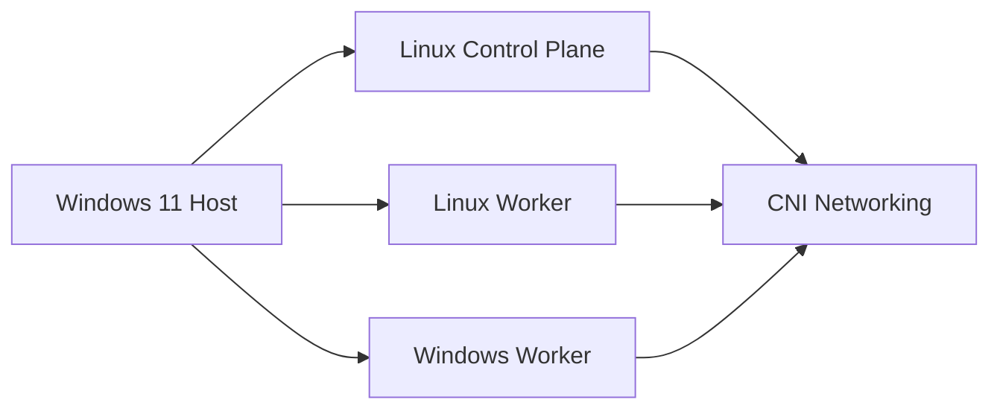

# CNI Networking

## Learning objectives

- Understand how the selected CNI provides pod networking and service reachability across Linux and Windows nodes.
- Relate the module to the overall Linux control-plane and Windows worker design.
- Identify what must be verified before moving on to the next module.

## Architecture overview

This module focuses on how the selected CNI provides pod networking and service reachability across Linux and Windows nodes. The recommended baseline keeps the Windows 11 host responsible for Hyper-V and operator tooling, Ubuntu Server nodes responsible for the Kubernetes control plane and Linux worker capacity, and Windows Server 2022 nodes responsible for Windows workload execution. Each step should reinforce those boundaries rather than blur them.

## Theory

This module explains how pod IP allocation, routing, overlays, and policy support depend on the chosen mixed-OS networking model. The goal is to make the moving parts visible enough that you can reason about normal behavior, failure behavior, and operational trade-offs without relying on a black-box installer.

## Windows-specific differences

- Not every CNI supports Windows, and feature depth can differ between Linux and Windows datapaths
- PowerShell and Windows service inspection are often part of the verification path.
- Host/image version alignment and OS-aware scheduling must stay explicit.

## Step-by-step implementation placeholder

1. [ ] Record the current architecture state for this module.
2. [ ] Apply the minimum configuration needed to move the lab forward.
3. [ ] Capture outputs and observations that prove the change worked.
4. [ ] Document rollback notes and follow-up risks.

## PowerShell commands placeholder

```powershell
# TODO: add Windows-specific commands for cni networking.
# Example: inspect Hyper-V, services, networking, or Windows node state.
```

## Linux commands placeholder

```bash
# TODO: add Linux-specific commands for cni networking.
# Example: inspect kubelet, containerd, routes, or cluster resources.
```

## YAML manifests placeholder

```yaml
# TODO: add Kubernetes manifests or snippets for cni networking.
# Keep OS selectors, labels, and namespaces explicit.
```

## Expected output placeholder

- TODO: define the healthy output expected from this module.
- TODO: capture any important warnings that are acceptable in the lab.
- TODO: note what should be true on Linux nodes, Windows nodes, and at the cluster level.

## Verification steps

- Compare the resulting state with the intended architecture.
- Verify both Kubernetes state and OS-level state.
- Confirm any Linux/Windows differences are visible and understood.

## Common errors

- version skew across Kubernetes, node OS, runtime, or images
- missing OS-aware scheduling or unsupported mixed-OS assumptions
- hidden DNS, routing, MTU, certificate, or time-sync problems

## Troubleshooting

- Start with the closest runbook under `/troubleshooting`.
- Collect events, node conditions, and service/runtime state before changing multiple layers at once.
- Add module-specific notes here as the lab matures.

## Production recommendations

- Choose a plugin with explicit mixed-OS support and test upgrades separately from production rollouts.
- Turn repeated manual steps into automation only after the behavior is understood.
- Validate Linux and Windows upgrade paths separately.

## Further reading

- Kubernetes documentation relevant to cni networking
- SIG-Windows notes where Windows behavior changes the design
- vendor or plugin documentation for the exact runtime, CNI, storage, or identity components you choose

## Mermaid diagram placeholder


